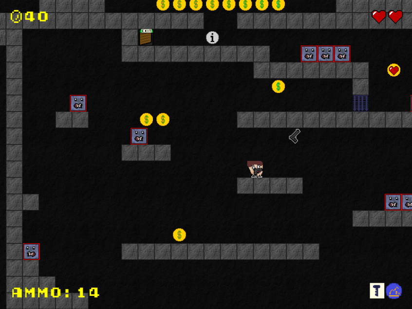
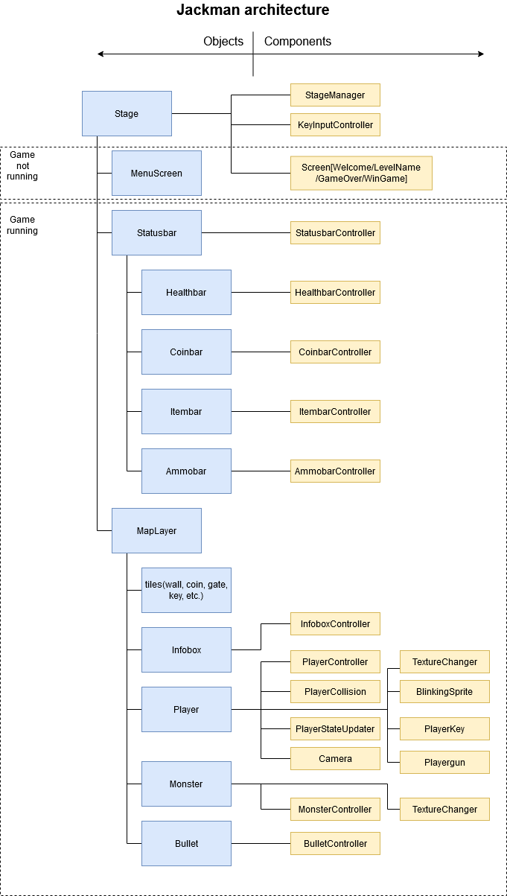

# Jackman (2D platformer) 

2D platformer game made as part of the [Architecture of Computer Games](https://https://aph.dodo.me/) (NI-APH) course at FIT ČVUT.

The game is deployed at [https://jackman.netlify.app](https://jackman.netlify.app).



# Setup
1. Run `npm install` to install dependencies.
2. Run `npm run dev` to create local dev server.
3. Navigate to [localhost:1234/index.html](localhost:1234/index.html) to play the game.

Or run npm build to build the game.

# Technology
 - PIXI.js
 - [PIXI-ECS library](https://aph.dodo.me/docs/ecsdocs)

# Controls
This game is basic 2D platformer. Jump over the platforms and try to reach the end of each level. Avoid monsters, collect coins, use powerups (double jump/flying), find keys to open locked gates! Enjoy!

| action   | keys           |
| -------- | -------------- |
| movement | left/right key |
| jump     | space          |
| fire     | ctrl           |
| use      | shift          |

# Game architecture
Game is usinng ECS pattern (pixi-ecs library). Blue squares are objects, yellow components.



## Global components
  - **Stage manager** - manages whole game. Initializations, loading levels, switching screens...

## MenuScreen components
  - **ScreenWelcome, ScreenLevelName, ScreenGameOver, ScreenWinGame** - shows initial/level name/game over/win game screen.

## Statusbar components
  - **StatusbarController** - holds information about different parts of statusbar - healthbar, coinbar etc.

    - **HealthbarController** - shows information about health in top right corner.

    - **CoinbarController** - shows information about collected coins in top left corner.

    - **ItembarController** - shows information about taken items in right bottom corner.

    - **AmmoController** - shows information about ammo in left bottom corner (only if player picked up gun).

## Maplayer (game) components
  - **InfoboxController** - prints the text of its infobox.

  - **PlayerController** - solves user input and basic physics engine - collision with walls, gravity, moving with player (NOT with powerups, monsters).

  - **PlayerCollision** - solves player collision with monsters/powerups/keys/infoboxes/exit door.

  - **PlayerStateUpdater** - takes care of health, coins, ammo, items, etc. It also sends messages to statusbars.

  - **Camera** - moves camera with player (owner).

  - **TextureChanger** - changes (flips) player or monster (owner) textures when they change direction.

  - **BlinkingSprite** - makes owner blinking, e.g. when monster hit player.

  - **PlayerKey** - is assigned to player, when he picks up key. It controlls, if the locked door can be open.

  - **PlayerGun** - is assgined to the player, when he takes a gun. It controls shooting (keyboard input, creating bullet) and also creates texture with gun on player. 

  - **MonsterController** - controlls movement of monster object.

  - **BulletController** - moves bullet left or right and checks for collision.


## Containers hiearchy
```
stage
  |
  |--MenuLayer (*in menu*)
  |
  |--Statusbar (*in game*)
  |      |
  |      |--Healthbar
  |      |--Coinbar
  |      |--Itembar
  |      |--Ammobar
  | 
  |--MapLayer (*in game*)
  |      |
  |      |--background
  |      |--tiles(grounds,powerups,items,monster)
  |      |--Monster
  |      |--Player
  |      |    |- gunsprite (if picked up gun)
  |      |
  |      |--Bullet
```


# Credits
Some parts of code (level parser, collision) are inspired by [blockbreaker example](https://github.com/dodocloud/games-course/tree/master/examples/src/game_blockbreaker).

Bitmap game font is created from [Early GameBoy font](https://www.dafont.com/early-gameboy.font) by Jimmy Campbell.

